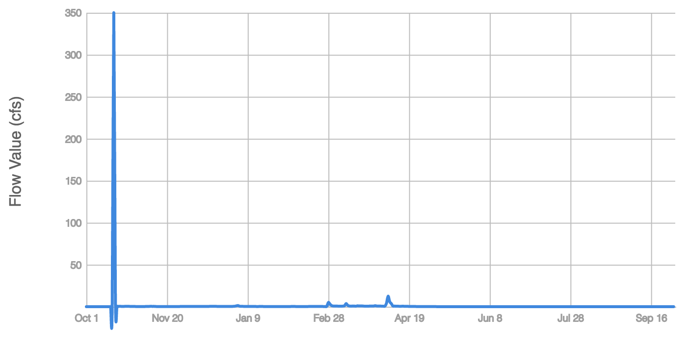
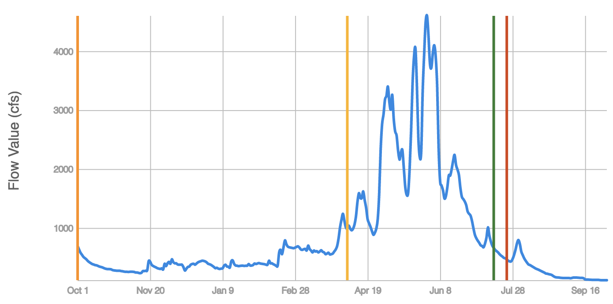
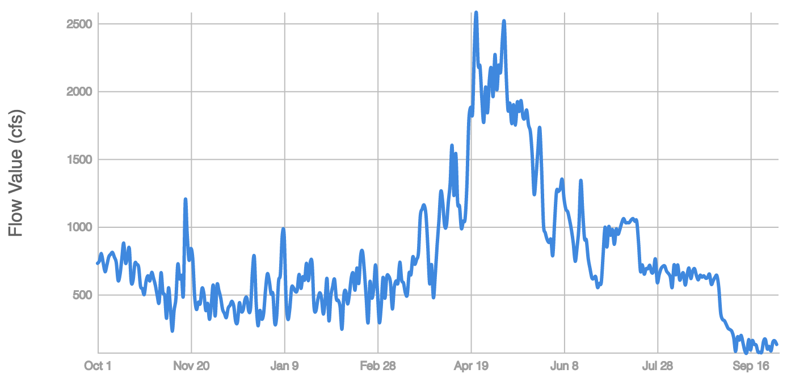

## Known Issues

Due to the complex nature of California's natural streamflow, the FFC metrics may perform suboptimally in certain water years that do not display expected seasonal flow patterns. This is an exception rather than the rule, however, since FFC results for every reference gage have been reviewed to ensure that flow patterns exhibit reference condition bahavior, and that functional flow component timing is generally as expected. The following documented issues represent outlier results that do not conform with the general tendencies of the reference data or the FFC.  

### 1. Extreme dry years

Water years of extremely low magnitude and variability in flow occasionally occur in the reference gages in classes LSR, PGR, FER, and RGW (Figure 1). In these water years, the timing of the functional flow components cannot be defined well because there is little seasonal flow variation to base the components off of. Often, these dry years will experience only one significant flow event during the water year, and all the functional flow components will be centered around this single event, giving them little meaning in the context of normal flow patterns for that hydrologic class. The magnitude metrics however, such as average annual flow and dry season baseflow, may still provide useful information by revealing the high degree of interannual flow variation that occurs due to dry water years. 

### 2. Wet season start timing is not identified

Occasionally an issue arises in the FFC results in which the start of the wet season timing is not set for certain water years, although timing will be set for other timing components such as spring recession and the dry season. This occurs because the specific algorithm requirements for magnitude and slope are not met in all water years. Although this issue will need to be resolved for optimal performance of the FFC, it only occurs in 1.7% of water years across all reference stream gages.  

### 3. Wet season initiation is not set or is identified on the first day of the water year

It is not uncommon for wet season initiation to not be set in some water years if the period between October 1st and December 15th does not experience a high enough peak flow, or any peaks in flow at all. In most classes, 10-35% of water years do not have a wet season initiation set. In HLP however 60% of water years do not have wet season initiation identified, which may indicate an issue with the FFC that will need to be addressed in future improvements.   

Another issue with the algorithm for wet season initiation is that it will occasionally identify the first day of the water year (October 1st) as the wet season initiation date (Figure 2). This presents an ambiguity because it is unclear from a one-year hydrograph whether flow on the first day is experiencing an actual peak or a continual decline. This is another issue that will need to be addressed in future improvements of the FFC. 

### 4. HSR flow data has unusually high day-to-day variation

The flow time series used for HSR reference gages were modeled by DWR based on current flow conditions and degree of alteration, to create "naturalized" reference flow time series. Although the annual and seasonal trends in the time series are appropriate for simulating prealteration conditions, the daily scale of the data sometimes does not behave naturally. In some water years, the naturalized time series show unnatural day-to-day fluctuations instead of smooth daily transitions more typical in natural flow data. Although this is not expected to greatly affect the magnitude of FFC metrics, the rate of change and timing metrics may be more affected. For example, the dry season low flows timing sometimes occurs later than expected in this class because the daily rate of change does not gradually recede like it does in natural flow gages. These issues will continue to exist until better naturalized flow data can be accessed for this hydrologic class. 

