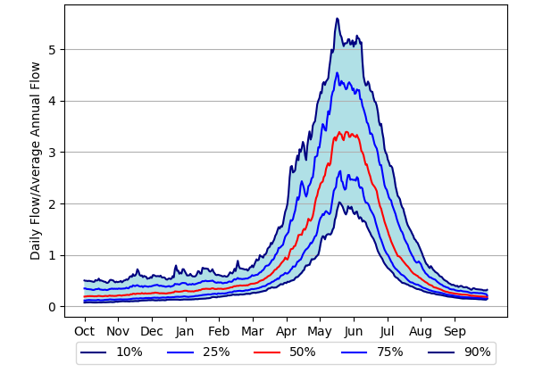

## Purpose

The eFlows Functional Flow Calculator \(FFC\) quantifies key hydrologic aspects of the annual flow regime from any daily streamflow time series. The FFC produces dimensionless reference hydrographs \(defined below\) and a suite of functional flow metrics that quantify functional flow components, referring to portions of the annual flow regime expected to serve distinct geomorphic or ecological functions \([Yarnell et al. 2015](https://academic.oup.com/bioscience/article/65/10/963/245807)\). Results are presented visually and data can be directly downloaded. The hydrographs and metrics enable comparisons of streamflow patterns across regions, natural stream classes, and various forms and magnitudes of flow alteration. The FFC generates 31 metrics describing aspects of streamflow timing, magnitude, duration, frequency, and rate of change, organized into four functional flow components: 1\) wet season initiation flows, 2\) peak magnitude flows, 3\) spring recession flows, and 4\) dry season low flows \(Table 1\).

## Stream Classification

California's streams can be organized into nine natural stream classes with distinct flow regime patterns and dominant watershed controls \(Figure 1\). These stream classes represent hydrologic conditions prior to major anthropogenic impacts including dams, diversions, and land use changes \([Lane et al. 2018](https://link.springer.com/article/10.1007/s00267-018-1077-7)\). 223 reference gages with 6 - 65 years of reference data formed the foundation for this effort, spanning a wide range of physiographic settings found in California \([Zimmerman et al. 2017](https://onlinelibrary.wiley.com/doi/full/10.1111/fwb.13058)\).

Figure 1. Map of California hydrologic classification.  

## Dimensionless Reference Hydrographs

The dimensionless reference hydrographs \(DRHs\) serve as a descriptive visual tool of continuous daily and inter-annual streamflow patterns \([Lane et al. 2018](https://link.springer.com/article/10.1007/s00267-018-1077-7)\). Every natural stream class and reference gage has an associated DRH.

A DRH is calculated by dividing daily streamflow data by the water year's average annual flow. This calculation is performed across all water years of flow data. Then, the 10th, 25th, 50th, 75th, and 90th percentile flows over the entire reference period of record are determined for each date of the water year. These results are then plotted to visualize the range of non-dimensionalized flow that occurs across the water year at a daily time-step. The DRH can represent the period of record for one stream gage, or the results can be aggregated across all reference gages in one stream class to summarize the flow patterns of an entire class. Figure illustrates an example DRH for a snowmelt-dominated stream class.

Figure 3. Dimensionless reference hydrograph.  

## Functional Flow Metrics

The functional flows calculator \(FFC\) quantifies key aspects of the annual flow regime  based on long-term daily streamflow time series data, producing a broad suite of descriptive functional flow metrics. These metrics are meant to characterize ecologically relevant components of any flow regime in a robust, objective manner to enable comparisons of streamflow across regions, natural stream classes, and various forms and magnitudes of flow alteration. The metrics are organized annually by water year, which is the 365 day period over which streamflow is assessed. The FFC uses October 1st - September 30th as the default water year, although this setting can be modified in Python by users of the FFC tool. The FFC generates 36 metrics describing aspects of streamflow timing, magnitude, duration, frequency, and rate of change, organized into four seasonally-based functional flow components: 1\) wet season initiation flows, 2\) peak magnitude flows, 3\) spring recession flows, and 4\) dry season low flows. For more theory behind the functional flow components, see \([Yarnell et al. 2015](https://academic.oup.com/bioscience/article/65/10/963/245807)\).

### Annual Metrics

* **Average annual flow**
  * Arithmetic mean daily flow in each water year.
* **Coefficient of variance**
  * Standard deviation of daily flow divided by arithmetic mean of flow in each water year.

### Wet Season Initiation Flows

This flow component describes the first significant increase in flow following the dry season baseflow. This initiation event often takes the form of a storm event that introduces a pulse of flow into the stream. It typically occurs each year but may not in some years depending on climate conditions.

* **Initiation event timing**
  * First date from October 1st to December 15th that flow exceeds the initiation event threshold, which is defined as twice the magnitude of the previous dry season’s base flow or 1 cfs, whichever is greater.
* **Initiation event magnitude**
  * Peak flow magnitude during the initiation event.
* **Initiation event duration**
  * Number of days from the start to the peak magnitude of the initiation event.

### Peak Magnitude Flows

A suite of metrics are calculated for the 2%, 5%, 10%, and 20% flow exceedance thresholds over the period of record. For example, the 2% exceedance flow is the flow magnitude that is only exceeded 2% of the time over the period of record. High flows may exceed these thresholds multiple times in some years and not at all in other years. These metrics are calculated for each high flow exceedance threshold in each water year and then the 10th, 50th, and 90th percentile metric values are calculated over the period of record:

* **High flow magnitude**
  * Peak flow magnitude above the high flow exceedance threshold
* **High flow timing**
  * Date of the peak flow for each high flow exceedance event
* **High flow duration**
  * Continuous duration that flow remains above the high flow exceedance threshold
* **High flow frequency**
  * Number of times threshold is exceeded per water year

Two additional wet season metrics are calculated:

* **Wet season start timing**
  * Start date of wet season, defined as the date that sufficient baseflow has accrued based on a magnitude threshold of 30% of the wet season’s peak flow.
* **Wet season baseflow magnitude**
  * 10th percentile daily flow from the start of the wet season to the start of the dry season.

### Spring Recession Flows

The spring recession encompasses the seasonal transition from wet season high flows to dry season baseflows. Metrics calculated include timing and magnitude of the start of the recession, duration of the recession period, and flow rate of change over that period.

* **Recession start timing**
  * Start date of spring recession. A search window is set around the last major storm event of the wet season, and the last local peak event within that window is identified as the end of the wet season. The spring recession start date is set as 4 days following the end of the wet season to reduce sensitivity to individual storm events.
* **Recession magnitude**
  * Flow magnitude at the start of the spring recession.
* **Recession duration**
  * Number of days of recession period from the spring recession start date to the dry season start date.
* **Recession rate of change**
  * Median daily flow rate of change over the spring recession period, considering only days with negative rates of change.

### Dry Season Low Flows

The dry season baseflow period represents the low magnitude, low variability portion of the year between wet seasons.

* **Dry season start timing**
  * Start date of the dry season baseflow period, identified based on criteria for relative magnitude, rate of change, and timing. A search window is set from the spring recession start date to the end of the water year \(Sep 30\), and the first date that flow magnitude falls below 12.5% of the wet season’s maximum flow, and rate of change approaches zero, is identified as the start of the dry season.
* **Dry season baseflow magnitude**
  * 10th percentile daily flow from the dry season start date to the wet season start date.
* **Dry season baseflow duration**
  * Duration of baseflow period, from the dry season start date to the wet season start date.
* **Dry season baseflow duration \(\# of no-flow days\)**
  * Number of days that flow magnitude is 0 during the dry season baseflow period.

Table 1. Summary of 31 functional flow metrics including the functional flow components they describe, the flow characteristic they quantify, and a brief description.

